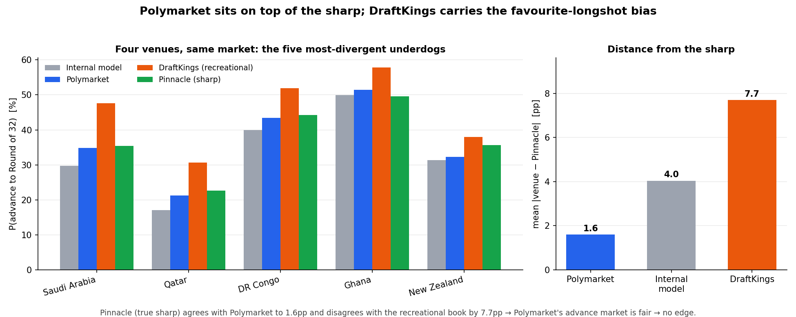

# World Cup 2026: Prediction-Market Mispricing Study

**Can a structural model of the group stage find mispricings in Polymarket's
directly-priced aggregate markets?**

This repo propagates Polymarket's liquid **match-level** odds through the full 2026 World
Cup group structure, derives aggregate probabilities (advance-to-knockout, group winner),
and tests them against the market's *own* aggregate prices and against external
sportsbooks. It ends in a clean, well-falsified **negative result**, and the discipline
used to get there - refusing to trust a model calibrated on the very market it benchmarks
against - is the point.



> **TL;DR.** An internal Monte-Carlo model flagged five "edges" vs Polymarket. A
> three-venue comparison showed those flags were a **modeling artifact** (the model is
> Polymarket's own view, amplified ~5pp by an independence assumption). The genuine,
> model-free divergence was between Polymarket and a *recreational* book (DraftKings).
> The tie-breaker - **Pinnacle**, the sharpest book in the world - sits on top of
> Polymarket (**mean 1.6pp**) and 7.7pp away from DraftKings. **Polymarket's advance
> market is at fair value; there is no edge, and DraftKings carries the textbook
> favourite-longshot bias.**

---

## The question

Prediction markets are widely sharp on single match outcomes. The working hypothesis was
that they might be *softer* on **long-range aggregates** (advancing from a group, winning
a group) - markets a casual crowd prices with sentiment and favourite-longshot bias. If
so, the match markets and the aggregate markets would be mutually *inconsistent*, and the
gap would be tradeable.

## Data - single-source design

All inputs come from one place: **Polymarket's Gamma API** (`gamma-api.polymarket.com`, no
key). The design deliberately uses a *single source* for the model so any disagreement is
internal and interpretable:

- **72 group fixtures**: moneyline (1X2) + Over/Under 2.5 goals per match.
- **Aggregate markets**: *advance to knockout* (48 binaries), *group winner* (12 events).

External sportsbook odds (DraftKings, Pinnacle) are introduced **only** at the validation
stage, as independent second/third prices.

## Statistical method

```
match 1X2   ──devig──▶  P(home/draw/away)
            ──fit────▶  bivariate-Poisson goal rates (λ₁, λ₂, λ₃ shared)   ◀── + P(over 2.5)
            ──simulate▶  joint Monte-Carlo of all 12 groups (50k draws)
            ──rank────▶  top-2 auto + 8 best 3rd-place ⇒ 32 of 48 advance
            ──aggregate▶ model P(advance), P(win group)
            ──compare─▶  vs Polymarket's own aggregate markets
            ──validate▶  vs DraftKings (recreational) vs Pinnacle (sharp)
```

1. **De-vigging.** Strip the bookmaker overround from each market to recover risk-neutral
   probabilities. Multi-outcome markets are rescaled to their known total (1X2 → 1.0; the
   48-team advance field → 32). Two-way book markets use symmetric two-way de-vig.
2. **Bivariate-Poisson match model.** For each match, fit goal rates **(λ₁, λ₂, λ₃)** by
   least-squares to three market targets — P(home win), P(away win) from the moneyline and
   P(over 2.5) from totals. The shared term **λ₃** introduces the home/away goal
   correlation and pins the goal total (the third degree of freedom), which drives goal
   difference and therefore the third-place cut-off. *The 1X2 is the priority signal;
   totals only set the goal level.*
3. **Joint, vectorised Monte-Carlo.** Simulate all 12 groups jointly (50,000 draws),
   applying the real tie-break ladder (points → goal difference → goals scored → random).
   The 2026 format advances the top two of each group **plus the eight best third-placed
   teams**, so the twelve third-place finishers are ranked across groups to select the
   eight that go through. `model P(advance) = P(top-2) + P(3rd ∧ best-8)`.
4. **Noise band.** Perturb the fitted λ's, re-simulate, and only flag a team if its edge
   exceeds **4pp AND twice the input-noise standard deviation** — guarding against
   spurious flags from input uncertainty.
5. **Cross-venue validation.** Convert sportsbook American/decimal odds → implied
   probability → de-vig to the same basis, and lay model, Polymarket, DraftKings and
   Pinnacle side by side for the teams that diverge.

## Results

**The match→aggregate propagation is internally coherent.** The model reproduces
Polymarket's own group-winner market to ~1–2 points, and `Σ P(advance) = 32` exactly - so
there is no easy *internal* arbitrage between the match and aggregate layers.

**The five "flags" were a modeling artifact.** Against Polymarket the model flagged Saudi
Arabia, Croatia, Canada, Qatar and Ivory Coast. But `|model − Polymarket|` was a
near-constant **~5pp**, always in the favourite-longshot direction - the fingerprint of
the independence assumption (treating a team's three correlated group games as
independent inflates favourites' survival). The model doesn't *discover* anything; it
amplifies Polymarket. The noise band cannot catch this - it sees input noise, not
model-specification error. **A third price can.**

**The three-venue extremeness ordering** `MODEL > POLYMARKET > DRAFTKINGS` revealed the
real, model-free divergence: Polymarket prices underdogs *lower* than DraftKings. Whether
that meant Polymarket was soft (the thesis) or DraftKings was biased (textbook) needed a
**true sharp** to settle.

**Pinnacle settles it** - direct "to qualify from group" prices, the five divergent
underdogs (P(advance to R32), %):

| Team | Internal model | Polymarket | DraftKings (rec.) | **Pinnacle (sharp)** |
|---|---:|---:|---:|---:|
| Saudi Arabia | 29.7 | 34.8 | 47.6 | **35.4** |
| Qatar | 17.1 | 21.2 | 30.7 | **22.6** |
| DR Congo | 39.9 | 43.4 | 51.9 | **44.3** |
| Ghana | 49.9 | 51.4 | 57.8 | **49.6** |
| New Zealand | 31.3 | 32.3 | 38.0 | **35.6** |
| **mean \|venue − Pinnacle\|** | 4.0pp | **1.6pp** | 7.7pp | — |

Pinnacle lands on top of Polymarket (Saudi Arabia differs by **0.6pp**) and ~8pp from
DraftKings. An independent proxy via Pinnacle's "reach the Round of 16" market, inverting
`P(reach R16) / P(advance)` to an implied single-knockout win rate, gave the same answer
(a realistic, tight 29.5 ± 2.9% under Polymarket's numbers vs an implausible 23.7 ± 4.2%
under DraftKings').

## Conclusion

- **No edge.** Polymarket's advance-to-knockout market is at sharp (Pinnacle) value.
- **DraftKings is the biased venue**, over-pricing underdogs - the classic recreational
  **favourite-longshot bias**, exactly as theory predicts.
- **The thesis is not supported** for liquid aggregate markets: simple
  dependent-probability propagation cannot beat a market that arbitrageurs already police.
- **Methodological takeaway** (the durable lesson): *a model calibrated **from** a market
  cannot detect edges **against** it* - it only re-expresses that market's view. Real edge
  detection requires an independent second price, and "fair" must be anchored to a true
  sharp, never a recreational book.

## Repository layout

| File | Role |
|---|---|
| `wc2026_joint.py` | **Main artifact.** Joint 12-group bivariate-Poisson Monte-Carlo, fit to live Polymarket 1X2 + totals; model vs market advance comparison with noise bands. |
| `sharp_compare.py` | **Cross-venue validation.** Model vs Polymarket vs DraftKings (3-way) and the Pinnacle sharp tie-breaker (`--pinnacle`). The decisive result. |
| `polymarket_wc.py` | Polymarket Gamma API client + low-level fetchers + a single-group (Group I) worked demo. |
| `wc2026_model.py` | Standalone reference simulator driven by hand-set team ratings (placeholder strengths, randomised bracket) — the exploratory engine, not the calibrated result. |
| `make_figure.py` | Renders `assets/results.png` from the captured result snapshot. |

## How to run

```bash
pip install -r requirements.txt          # numpy, scipy (+ matplotlib for the figure)

python wc2026_joint.py                    # full joint model vs Polymarket  (~1–2 min: 144 fetches + sim)
python sharp_compare.py                   # model-free: Polymarket vs DraftKings  (fast)
python sharp_compare.py --model           # three-way: model vs Polymarket vs DraftKings
python sharp_compare.py --pinnacle        # the sharp tie-breaker (Pinnacle)  ← headline result
python make_figure.py                     # regenerate assets/results.png
```

Live runs hit the Polymarket Gamma API (no key needed); numbers shift slightly as the
market moves. The DraftKings and Pinnacle prices are pre-tournament (June 2026) snapshots
hard-coded in `sharp_compare.py` - true-sharp "to qualify" prices are not freely scrapable
and were read manually off a Pinnacle account.

## Limitations

- Assumes a team's three group games are **independent** (no tournament-form correlation)
  and ignores **dead-rubber rotation** in the final group game - the two effects most
  likely behind any residual favourite tilt.
- The `wc2026_model.py` knockout bracket is **randomised**, not the official R32
  third-place map; treat its win-cup numbers as illustrative only.
- All odds are **pre-tournament snapshots**; this is research tooling, not a live trading
  system.
